<div id="top"></div>

<!-- PROJECT LOGO -->
<br />
<div align="center">

<h3 align="center">Zwallet</h3>

  <p align="center">
    NextJs project E-money App
    <br/>
    
  </p>
</div>

for backend repository click [this](https://github.com/farizian/chatting_BE)

<!-- TABLE OF CONTENTS -->
<details>
  <summary>Information</summary>
  <ol>
    <li>
      <a href="#about-the-project">About The Project</a>
      <ul>
        <li><a href="#built-with">Built With</a></li>
      </ul>
    </li>
    <li><a href="#demo">Demo</a></li>
    <li>
      <a href="#getting-started">Getting Started</a>
      <ul>
        <li><a href="#installation">Installation</a></li>
      </ul>
    </li>
    <li><a href="#screenshot">Screenshot</a></li>
    <li><a href="#contact">Contact</a></li>
  </ol>
</details>


<!-- ABOUT THE PROJECT -->
## About The Project

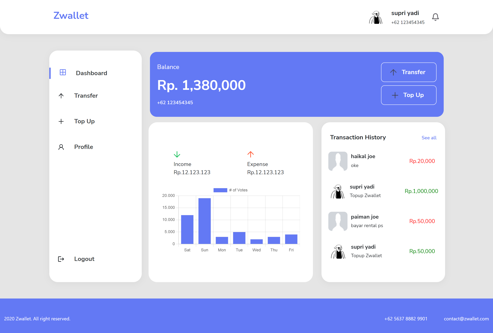

ZWallet is a digital Wallet web application built using Next.js framework with pin validation in transfer function, and topup
built with nextJs, and Redux on the front end, and ExpressJs, NodeJs, and sequelize on the backend.


<p align="right">(<a href="#top">back to top</a>)</p>


### Built With

* [Next.js](https://nextjs.org/)
* [React.js](https://reactjs.org/)
* [Reactstrap](https://reactstrap.github.io/)
* [Axios](https://www.npmjs.com/package/axios)
* [Vercel](https://vercel.com/)
* [Heroku](https://www.heroku.com/)
* [backend](https://github.com/farizian/zwalletBE)
* [Demo](https://zwallet-five.vercel.app/)

<p align="right">(<a href="#top">back to top</a>)</p>

<!-- GETTING STARTED -->
<div id="demo"></div>

## Demo
This is a link to the demo [ZWallet App](https://zwallet-five.vercel.app/))
- Login user
  ```
  email: supri@gmail.com
  pass: 123
  ```

<!-- GETTING STARTED -->
<div id="getting-started"></div>

## Getting Started

### Prerequisites
* npm
  ```sh
  npm install npm@latest -g
  ```

### Installation

1. [Clone API](https://github.com/farizian/zwalletBE)
2. Clone the repo
   ```sh
   git clone https://github.com/farizian/zwallet
   ```
3. Install NPM packages
   ```sh
   npm install
   ```
4. Create your API in file `.env`
   ```.env
   NEXT_PUBLIC_API_URL= 'YOUR API URL'
   ```

<p align="right">(<a href="#top">back to top</a>)</p>

<!-- ROADMAP -->
## Screenshot

>Web page

Home page           |  Home Page Mobile
:-------------------------:|:-------------------------:
  |  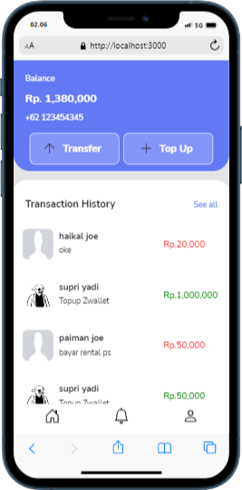


Landing Page           |  Landing Page
:-------------------------:|:-------------------------:
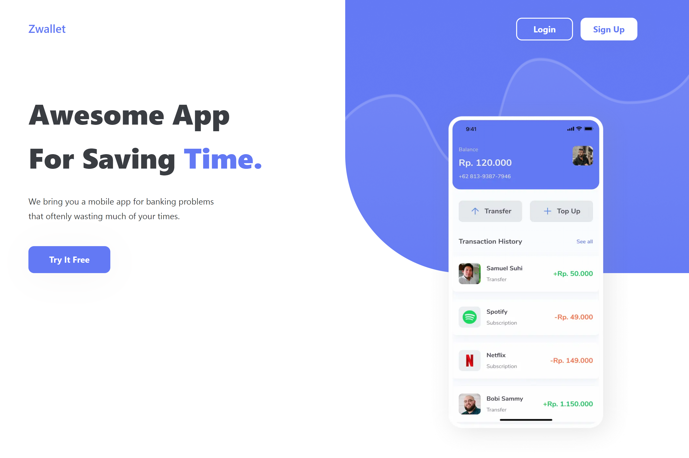  |  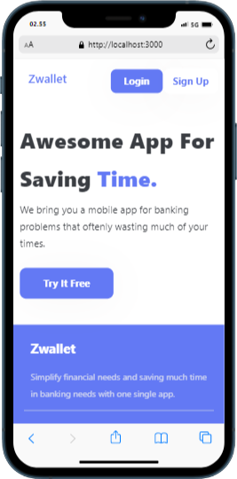


Register           |  Register Mobile
:-------------------------:|:-------------------------:
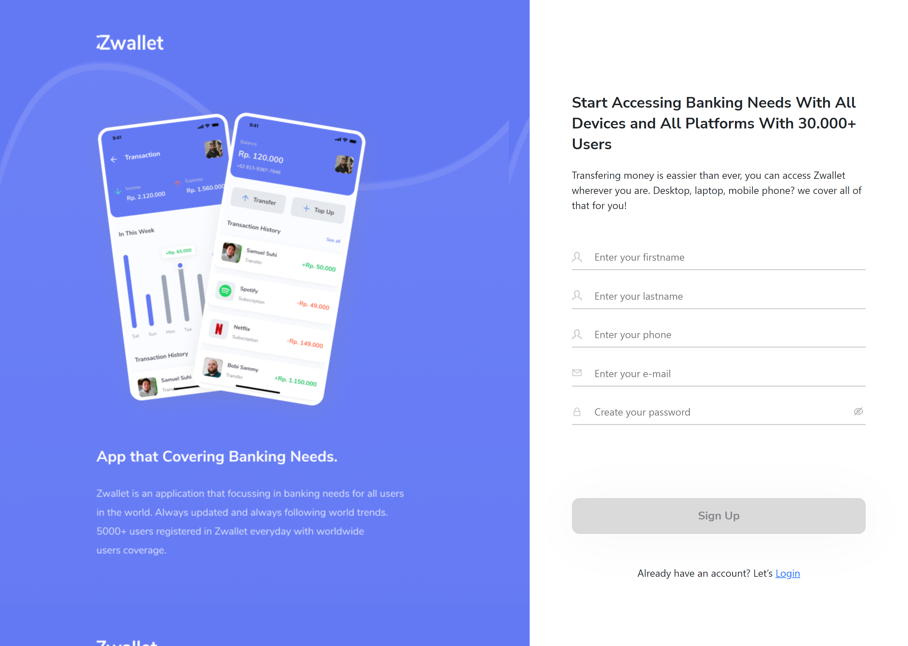  |  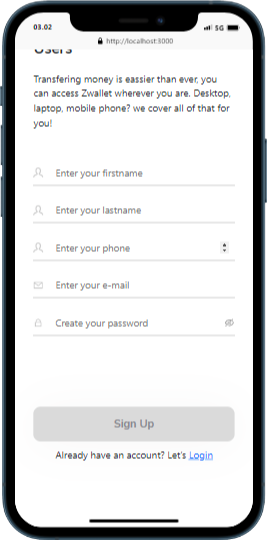


Login           |  Login Mobile
:-------------------------:|:-------------------------:
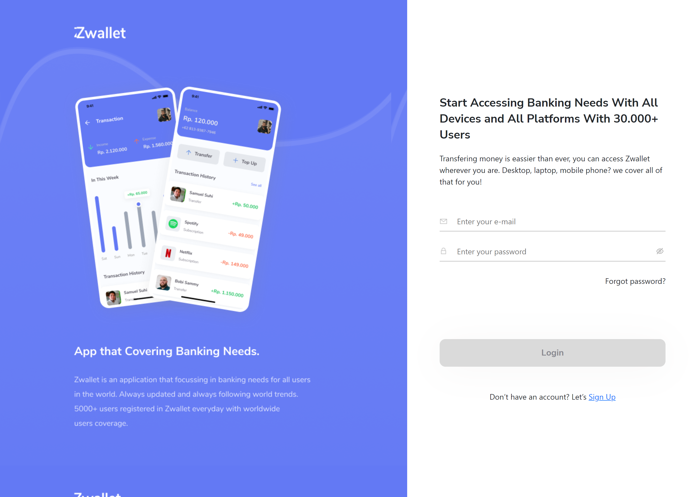  |  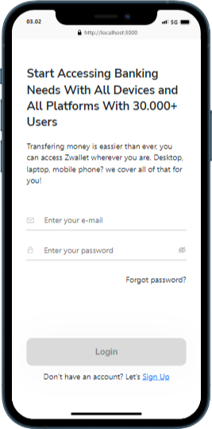


Input Pin           |  Input Pin Mobile
:-------------------------:|:-------------------------:
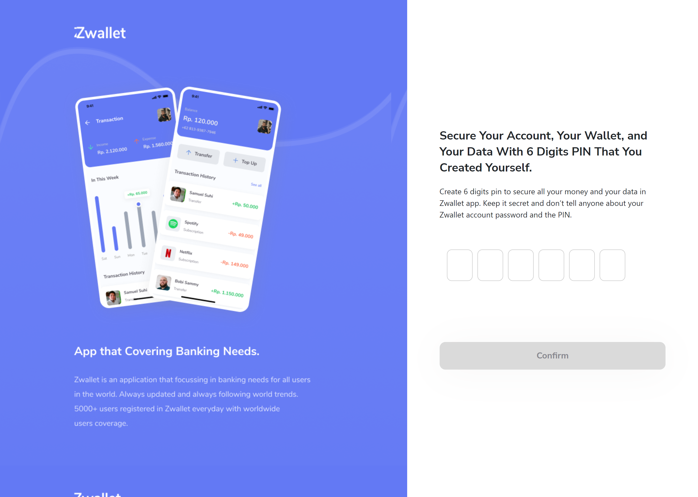  |  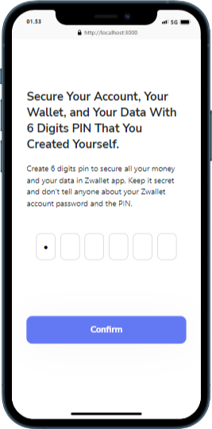


User Transfer           |  User Transfer Mobile
:-------------------------:|:-------------------------:
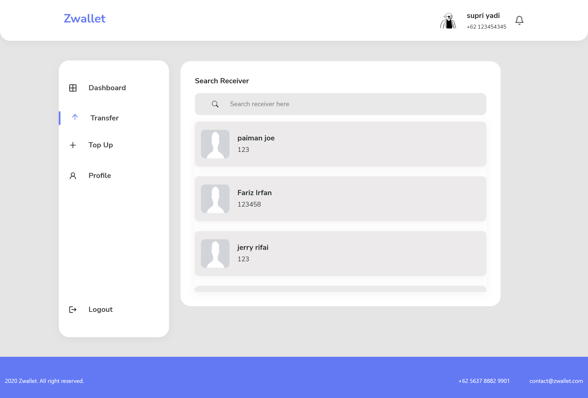  |  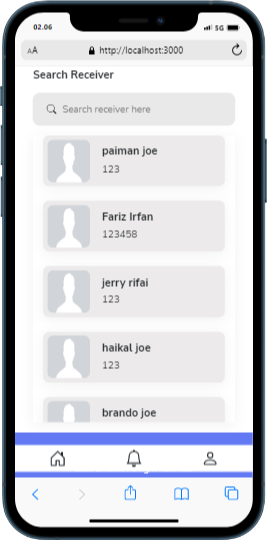


Top-Up           |  Top-Up Mobile
:-------------------------:|:-------------------------:
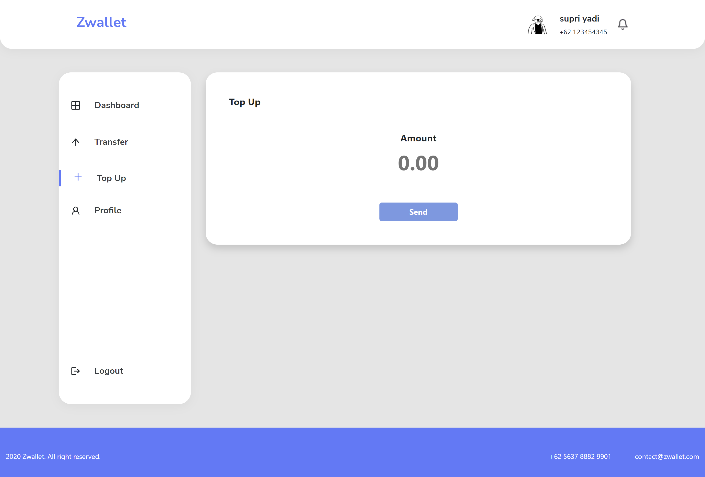  |  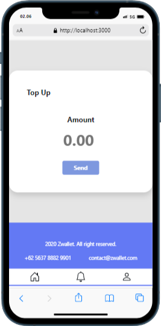


Profile           |  Profile Mobile
:-------------------------:|:-------------------------:
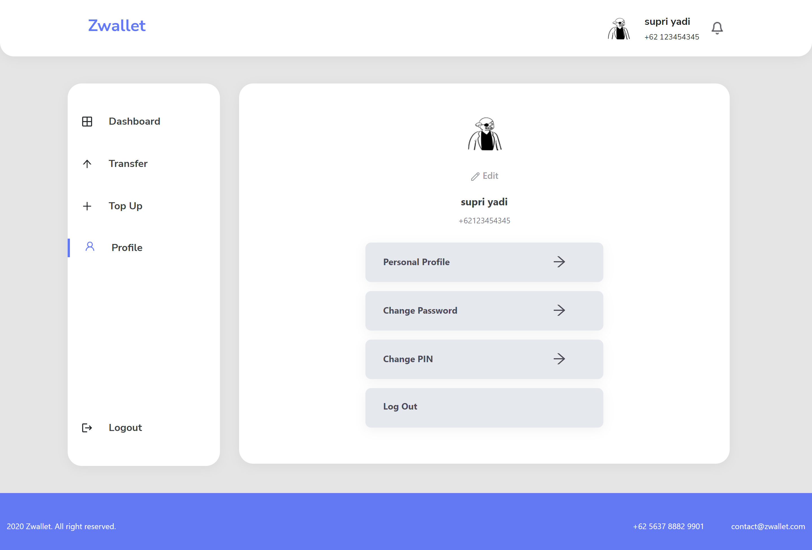  |  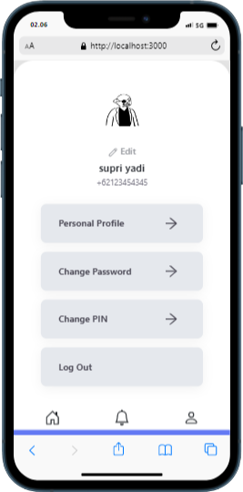

<p align="right">(<a href="#top">back to top</a>)</p>


<!-- CONTACT -->
## Contact

Fariz Irfan Rifai  - [@instagram](https://www.instagram.com/farizirfan008/) - farizirfan8@gmail.com

<p align="right">(<a href="#top">back to top</a>)</p>

